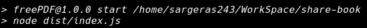

# Share books

A web site where you can download free books.

# Requirement

- nodejs
- npm

This project is written in javascript usin nodejs as backend.

You can download nodejs [*here.*](https://nodejs.org/es/download/current/)

You can also install nodejs using the package managers of your OS following this [*guide.*](https://nodejs.org/es/download/package-manager/)


# Start project

## - Download the project

First, download this repository with git:
```
git clone https://github.com/scesi/share-book.git
```

For to start the server, first you need to install the dependencies, to download the dependencies run:
```
npm install
```

After run:
```
npm run babel
```

Finally run:
```
npm start
```
You will see the following message on the console.


